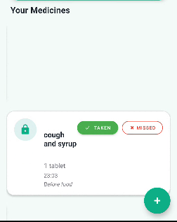
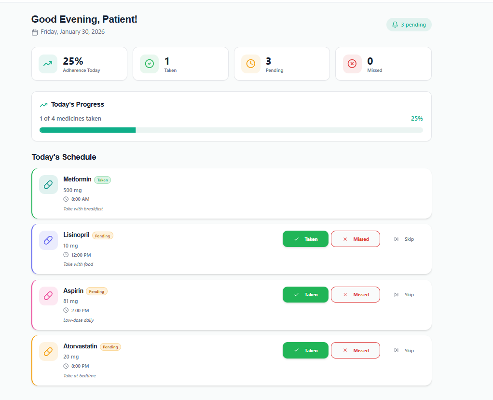

# MediSure

MediSure is a native Android application designed to help patients and caregivers seamlessly track medication schedules. With a focus on a premium user experience and adherence, MediSure introduces a **Calming Teal** design system and robust, intuitive native interactions.

## Features

- **Daily Dashboard**: View your medication progress for the day, beautifully displayed using a `CircularProgressIndicator` with real-time percentage completion.
- **Swipe-to-Delete**: Effortlessly swipe left-to-right to discard medications, complete with a visually appealing red background trash-can confirmation.
- **Calming Teal Design System**: A premium, editorial, and card-based layout featuring a pristine Light Mode and a seamless, high-contrast Dark Mode.
- **Medication History**: Check off a complete history of all your ingested medications.
- **Notifications & Alarms**: Stay on top of your schedule with integrated `AlarmManager` alerts. You don't even have to open the app; native notification actions let you mark a pill as Taken directly from your lock screen!
- **Caregiver Tools**: Instantly assess patient risk (Low/Medium/High) and adherence with specialized caregiver dashboards.

## Screen Designs

*Here are a few glimpses of our sleek Dark & Light user interfaces:*

### Patient Dashboard Iterations & Interactions

## Tech Stack

- **Android SDK:** Kotlin, XML.
- **Architecture:** Material Design standard, custom adapters, and handlers.
- **Networking/Database:** Supabase via Retrofit & OkHttp.
- **UI Toolkit:** Native Android Views, `RecyclerView`, `ItemTouchHelper`, and customized Material 3 components.

## Setup

1. Add your `local.properties` environment variable containing your `SUPABASE_URL` and `SUPABASE_KEY`.
2. Build project using Gradle: `./gradlew assembleDebug`
3. Launch on a real device or emulator.
