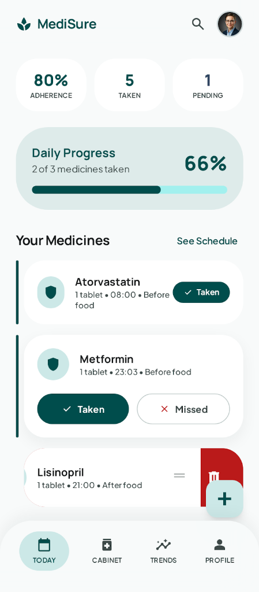
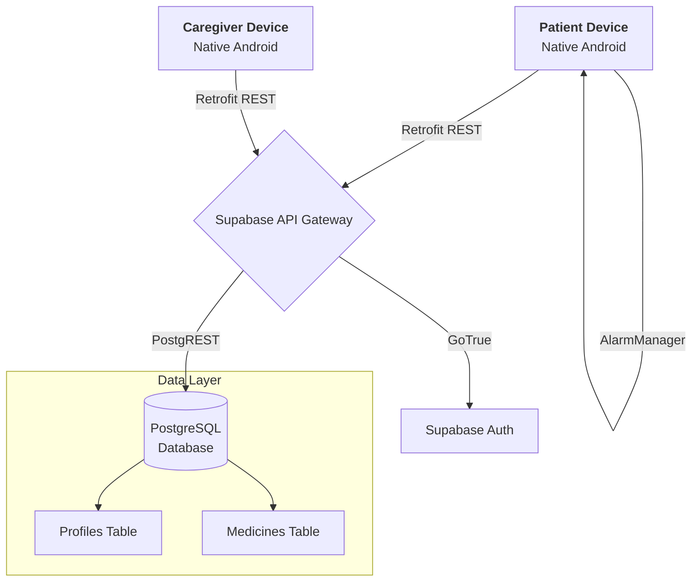

<div align="center">
  
  <h1>MediSure (Medicare)</h1>
  <p><b>A beautifully crafted, robust Android application designed to elevate medication adherence and caregiver peace of mind.</b></p>

  [](https://kotlinlang.org/)
  [](https://developer.android.com/)
  [](https://supabase.com/)
  
</div>

<br>

MediSure seamlessly bridges the gap between structured health schedules and a premium, accessible user experience. Built completely native with Kotlin and powered by an ultra-fast Supabase REST layer, MediSure delivers local notifications, real-time sync, and granular tracking. 

## ✨ Key Features

- 🟢 **Calming Teal Design System:** A highly polished, editorial-styled UI constructed entirely using native XML. Features comprehensive **Light and Dark Mode** adaptations ensuring accessibility at any hour.
- 📊 **Animated Daily Dashboard:** Keep track of the day's tasks instantly with a beautifully styled Material 3 `CircularProgressIndicator` that updates adherence statistics as pills are taken.
- 📲 **Swipe-To-Delete Gestures:** Complete your routine with intuitive left-to-right swipe physics, augmented by background color transitions and destructive action indicators.
- ⏰ **Lock-Screen Notifications:** Background `AlarmManager` configurations push timely system alerts. Patients can mark their medications as "Taken" directly from their lock screen using deep-linked `PendingIntents` without needing to open the app.
- 🧑‍⚕️ **Caregiver Command Center:** A devoted workflow for caregivers to monitor assigned patients, visualizing their real-time adherence levels and stratifying their "Risk Status" dynamically.
- 🔒 **Secure Authorization:** Token-based, REST-driven authentication connecting natively to Supabase's managed Postgres instance. 

---

## 🎯 Uses of MediSure

MediSure is designed for both individuals and caregivers who need a reliable, modern solution for health management. Key use cases include:
- **Personal Medication Tracking:** Easily log daily prescriptions, supplements, or vitamins to ensure you never miss a dose.
- **Caregiver Monitoring:** Monitor family members or patients remotely, tracking their adherence and intervening when a dose is missed.
- **Inventory Management:** Keep track of your pill stock and get alerts when it's time to request a refill.
- **Routine Building:** Transition from chaotic pillboxes to an elegant, habit-building digital interface.
- **Actionable Health History:** Export or review historical adherence data to share with healthcare professionals during checkups.

---

## 📸 In-App Experiences

*Previewing the new "Calming Teal" interfaces:*

<p align="center">
  
</p>

---

## 🏛️ System Architecture

MediSure operates via a clean model-view decoupled architecture, communicating exclusively over secure HTTPS endpoints natively formatted to Retrofit.



---

## 🗄️ Database Schema & RLS

MediSure enforces ultra-strict Row-Level Security (RLS) within Supabase. Data requests bypass SDK boundaries through fully native Retrofit models. For self-hosting or deployment, execute the following within the Supabase SQL Editor:

```sql
-- Enable UUID extension
create extension if not exists "uuid-ossp";

-- PROFILES (Public user data)
create table profiles (
  id uuid references auth.users on delete cascade not null primary key,
  email text,
  full_name text,
  avatar_url text,
  role text check (role in ('patient', 'caregiver')) default 'patient',
  created_at timestamp with time zone default timezone('utc'::text, now()) not null
);

-- MEDICINES
create table medicines (
  id uuid default uuid_generate_v4() primary key,
  user_id uuid not null,
  name text not null,
  dosage text, 
  stock integer default 0,
  unit text, 
  instructions text,
  reminder_time text, 
  created_at timestamp with time zone default timezone('utc'::text, now()) not null
);

-- STRICT RLS Policies
alter table profiles enable row level security;
alter table medicines enable row level security;

create policy "Users can view own profile" on profiles for select using (auth.uid() = id);
create policy "Users can update own profile" on profiles for update using (auth.uid() = id);

create policy "Users can view own medicines" on medicines for select using (auth.uid() = user_id);
create policy "Users can insert own medicines" on medicines for insert with check (auth.uid() = user_id);
create policy "Users can update own medicines" on medicines for update using (auth.uid() = user_id);
create policy "Users can delete own medicines" on medicines for delete using (auth.uid() = user_id);
```

---

## 🚀 Local Installation

1. **Clone the repository:**
   ```bash
   git clone https://github.com/theo-odore/Medicare.git
   cd Medicare
   ```
2. **Environment Variables:**
   For security, API keys are completely stripped from source control. In the root directory of your app (`d:/projects/MediSure`), create a file titled `local.properties`. Append your Supabase configuration parameters:
   ```properties
   SUPABASE_URL="https://your-project-url.supabase.co"
   SUPABASE_KEY="your-anon-api-key"
   ```
3. **Build Target:**
   Sync the Gradle environment and execute a debug build utilizing the local terminal or Android Studio:
   ```bash
   ./gradlew assembleDebug
   ```
4. **Deploy:**
   Target a connected Emulator or physical native device:
   ```bash
   ./gradlew installDebug
   ```

---

## 🛠️ Stack & Dependencies

| Layer | Technology | 
| ----- | ----------- | 
| **Language** | Kotlin |
| **Networking** | Retrofit 2 & OkHttp 3 Logging Interceptor |
| **Parsing** | Gson converter factories |
| **UI Mapping** | Material 3 Components, RecyclerView, Cards |
| **Gestures** | AndroidX `ItemTouchHelper` |
| **Backgrounding** | Native `AlarmManager` & `NotificationCompat` |

---

*Designed for reliability. Built for scale.*
